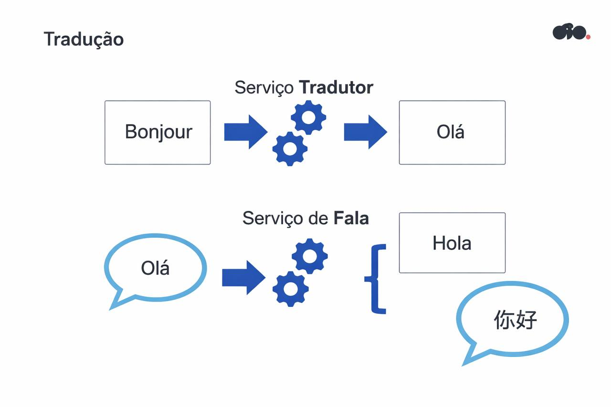
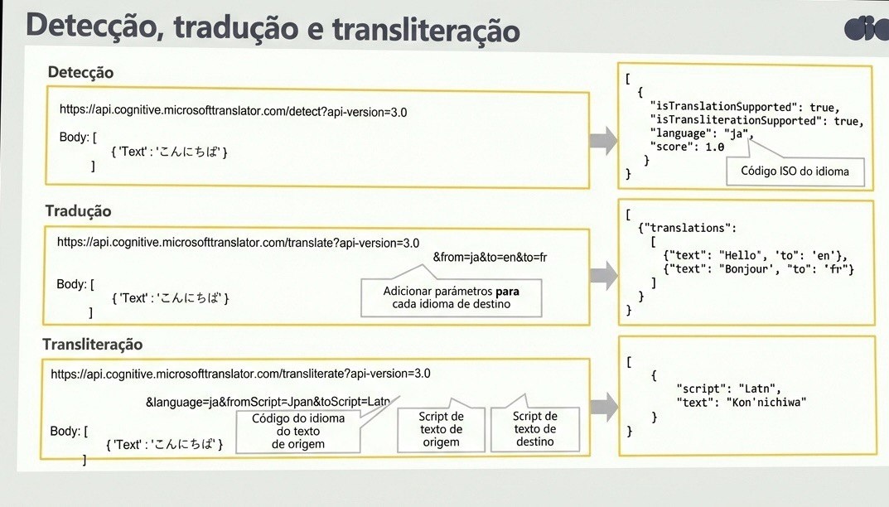
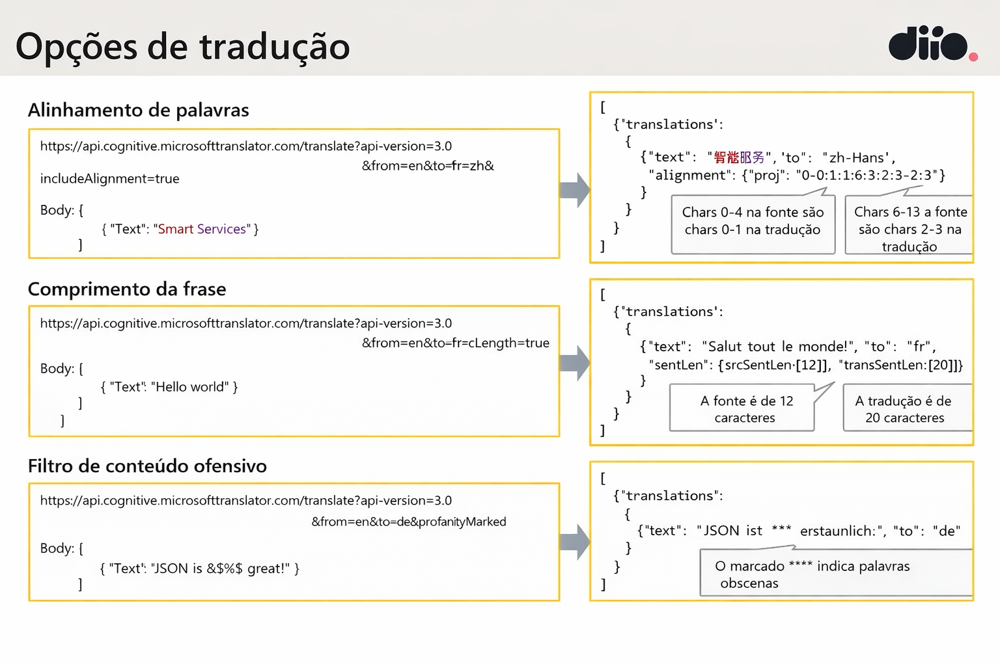
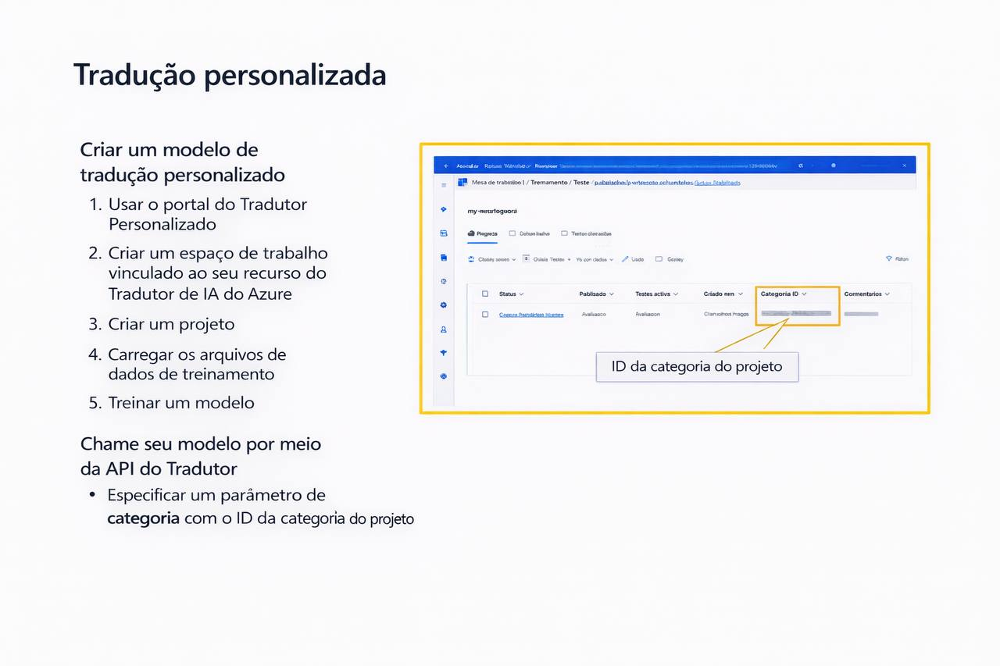

# Tradutor de Artigos Técnicos com Azure AI

<p align="center">

</p>

<p align="center"><i>Tradução Inteligente com IA e Nuvem</i></p>

---

[](https://github.com/mateus-ferreira-gomes/tradutor-artigos-tecnicos-azureai/stargazers)
[](https://github.com/mateus-ferreira-gomes/tradutor-artigos-tecnicos-azureai/network)
[](https://github.com/mateus-ferreira-gomes/tradutor-artigos-tecnicos-azureai/issues)


---

## 📖 Visão Geral

Este projeto implementa um sistema completo de tradução automática de artigos técnicos utilizando serviços de Inteligência Artificial da Microsoft Azure.

A arquitetura combina dois serviços principais:

* 🌍 **Azure AI Translator** — responsável pela tradução neural inicial entre idiomas.
* 🤖 **Azure OpenAI (GPT-4o mini)** — utilizado para refinamento contextual, ajuste de terminologia técnica e melhoria de fluidez.

O fluxo do sistema funciona da seguinte forma:

1. Extração do conteúdo (texto simples, documento `.docx` ou artigo da web).
2. Tradução inicial com Azure Translator.
3. Refinamento técnico com Azure OpenAI.
4. Exportação do conteúdo final em `.docx` ou `.md`, preservando estrutura e formatação.

O projeto demonstra na prática:

* Integração com APIs REST da Azure
* Uso de autenticação via chave e endpoint
* Manipulação de documentos Word
* Web scraping com BeautifulSoup
* Organização modular em Python
* Boas práticas com variáveis de ambiente

---

## 📑 Tabela de Conteúdos

* [📖 Visão Geral](#-visão-geral)
* [📖 Motivação](#-motivação)
* [✨ Funcionalidades](#-funcionalidades)
* [🧠 Como Funciona a Tradução](#-como-funciona-a-tradução)
* [🧩 Detecção, Tradução e Transliteração](#-detecção-tradução-e-transliteração)
* [⚙️ Recursos Avançados do Azure Translator](#️-recursos-avançados-do-azure-translator)
* [🏷️ Tradução Personalizada (Custom Translator)](#️-tradução-personalizada-custom-translator)
* [🧩 Estrutura do Projeto](#-estrutura-do-projeto)
* [🚀 Fases do Desenvolvimento](#-fases-do-desenvolvimento)
* [🔧 Tecnologias Utilizadas](#-tecnologias-utilizadas)
* [▶️ Como Rodar](#️-como-rodar)
* [📸 Prints do Projeto](#-prints-do-projeto)
* [🤝 Contribuindo](#-contribuindo)
* [📜 Licença](#-licença)
* [👤 Autor](#-autor)

---

## 📖 Motivação

Profissionais de tecnologia consomem diariamente artigos, documentações e pesquisas publicadas majoritariamente em inglês. Apesar da vasta disponibilidade de conteúdo, a barreira linguística ainda limita o acesso pleno ao conhecimento técnico para muitos leitores.

Este projeto nasce com dois propósitos principais:

1. Democratizar o acesso a conteúdos técnicos por meio de tradução inteligente.
2. Demonstrar, na prática, a construção de uma solução baseada em IA na nuvem utilizando serviços da Microsoft Azure.

A proposta vai além da tradução literal: combina modelos neurais de tradução com modelos de linguagem avançados para garantir precisão técnica, fluidez textual e preservação estrutural.

Ao longo do desenvolvimento, o projeto explora:

- Integração com APIs REST  
- Autenticação segura com variáveis de ambiente  
- Arquitetura modular em Python  
- Manipulação programática de documentos  
- Aplicação prática de LLMs em um pipeline real  

> 💡 Este projeto representa a convergência entre IA aplicada, engenharia de software e arquitetura em nuvem.

---

## ✨ Funcionalidades

* Tradução multilíngue com Azure Translator
* Refinamento técnico com Azure OpenAI
* Tradução de documentos Word (.docx)
* Extração e tradução de artigos da web
* Exportação em Markdown
* Estrutura modular organizada em `src/`
* Configuração segura via variáveis de ambiente

---

## 🧠 Como Funciona a Tradução

<p align="center">

</p>

<p align="center">
<i>Arquitetura conceitual do pipeline de tradução com Azure AI.</i>
</p>

### 🌍 1. Serviço Tradutor

Responsável pela tradução neural inicial entre idiomas, utilizando o Azure AI Translator.

Exemplo:  
Bonjour → Olá

### 🤖 2. Serviço de IA (Refinamento)

Responsável pelo ajuste contextual, padronização de terminologia técnica e melhoria da fluidez do texto, utilizando o Azure OpenAI (GPT-4o mini).

Essa abordagem híbrida garante:

* Maior precisão técnica
* Melhor fluidez textual
* Preservação do contexto
* Adaptação terminológica

---

## 🧩 Detecção, Tradução e Transliteração

<p align="center">
  
</p>

<p align="center">
  <i>Exemplos de requisições e respostas das APIs de detecção, tradução e transliteração do Azure Translator.</i>
</p>

---

## ⚙️ Recursos Avançados do Azure Translator

### 🔹 Alinhamento de palavras (Word Alignment)
Permite mapear quais partes do texto original correspondem à tradução.

### 🔹 Comprimento da sentença (Sentence Length)
Retorna a quantidade de caracteres do texto original e traduzido.

### 🔹 Filtro de conteúdo ofensivo (Profanity Filter)
Permite mascarar ou sinalizar termos ofensivos na tradução.

<p align="center">
  
</p>

<p align="center">
  <i>Exemplos de parâmetros avançados disponíveis na API do Azure Translator.</i>
</p>

---

## 🏷️ Tradução Personalizada (Custom Translator)

O Azure AI Translator permite a criação de modelos de tradução personalizados para domínios específicos.

<p align="center">
  
</p>

<p align="center">
  <i>Interface do Custom Translator e identificação do ID da categoria do modelo publicado.</i>
</p>

---

## 🧩 Estrutura do Projeto

```text
tradutor-artigos-tecnicos-azureai/
│
├── README.md
│   → Documento principal do projeto (Contém visão geral, instruções de execução, arquitetura, fases de desenvolvimento e documentação geral).
│
├── requirements.txt
│   → Lista de dependências Python necessárias para executar o projeto corretamente.
│
├── notebooks/
│   │
│   ├── tradutor_colab.ipynb
│   │   → Notebook para testes iniciais de tradução (Permite validar chamadas à API, testar textos simples e documentos).
│   │
│   └── artigo_web_colab.ipynb
│       → Notebook focado na extração e tradução de artigos da web (utilizando BeautifulSoup e Azure OpenAI).
│
├── src/
│   │
│   ├── azure_translator.py
│   │   → Implementa a comunicação com o serviço Azure AI Translator.
│   │     Responsável pela tradução inicial do texto.
│   │
│   ├── azure_openai.py
│   │   → Gerencia chamadas ao Azure OpenAI.
│       - Realiza refinamento contextual
│       - Melhoria de terminologia técnica
│       - Organização em Markdown.
│   │
│   └── utils.py
│       → Contém funções auxiliares como:
│         - Manipulação de texto
│         - Tratamento de arquivos
│         - Funções reutilizáveis do projeto
│
├── docs/
│   │
│   ├── images/
│   │   └── banner.png
│   │       → Imagem exibida no topo do README.
│   │   └── fluxo-traducao.jpg
│   │       → Arquitetura conceitual do pipeline de tradução com Azure AI.
│   │   └── deteccao-traducao-transliteracao.jpg
│   │       → Exemplo de chamadas API para detecção, tradução e transliteração.
│   │   └── opcoes-traducao.png
│   │       → Exemplo de parâmetros avançados da API do Azure Translator (alinhamento, comprimento e filtro de conteúdo).
│   │   └── traducao-personalizada.jpg
│   │       → Interface do Custom Translator e exemplo de ID de categoria para uso via parâmetro `category` na API.
│   │
│   ├── azure_translator_setup.md
│   │   → Guia detalhado para criação e configuração
│   │     do recurso Azure AI Translator.
│   │
│   ├── azure_openai_setup.md
│   │   → Passo a passo para criação do recurso
│   │     Azure OpenAI e implantação do modelo GPT-4o mini.
│   │
│   └── guia_projeto.md
│       → Explicação detalhada da arquitetura, fluxo de tradução e decisões técnicas.
│
└── .gitignore
    → Define arquivos e pastas que não devem ser versionados (chaves, ambientes virtuais, arquivos temporários, etc.).

```

---

## 🚀 Fases do Desenvolvimento

### 🔹 Fase 1 – Configuração no Azure

* Criação do recurso Translator (Free F0)
* Criação do recurso Azure OpenAI (Standard S0)
* Implantação do modelo GPT-4o mini no Azure AI Studio
* **📌 Aprendizado:** compreensão de autenticação via API Key e integração com endpoints.

### 🔹 Fase 2 – Notebook no Colab

* Testes iniciais de tradução
* Tradução de documentos Word
* Tradução de artigos da web com exportação em Markdown
* **📌 Aprendizado:** integração prática entre Python e APIs externas.

### 🔹 Fase 3 – Tradução de Documentos

* Implementação da função `translate_document(path, target_language)`
* Geração automática de arquivos com sufixo `_pt.docx`
* **📌 Aprendizado:** manipulação de arquivos Word com `python-docx`.

### 🔹 Fase 4 – Extração e Tradução Web

* Uso de BeautifulSoup para extração de conteúdo
* Tradução com Azure OpenAI via LangChain
* Exportação estruturada em Markdown
* **📌 Aprendizado:** aplicação de web scraping com IA.

### 🔹 Fase 5 – Visualização em Markdown

* Exportação para `.md`
* Visualização no VS Code e Markdown Viewer
* **📌 Aprendizado:** importância da estrutura Markdown para manter clareza.

---

## 🔧 Tecnologias Utilizadas

### 🧠 Serviços de IA

* Azure AI Translator
* Azure OpenAI (GPT-4o mini)

### 🛠️ Linguagem e Ferramentas

* Python 3.10
* Google Colab
* VS Code
* BeautifulSoup4
* LangChain
* python-docx

---

## ▶️ Como Rodar

1️⃣ **Clone o repositório**

```bash
git clone https://github.com/mateus-ferreira-gomes/tradutor-artigos-tecnicos-azureai.git
cd tradutor-artigos-tecnicos-azureai

```

2️⃣ **Instale as dependências**

```bash
pip install -r requirements.txt

```

3️⃣ **Configure as variáveis de ambiente**

```bash
export AZURE_TRANSLATOR_KEY="sua-chave"
export AZURE_TRANSLATOR_ENDPOINT="https://api.cognitive.microsofttranslator.com"
export AZURE_OPENAI_KEY="sua-chave"
export AZURE_OPENAI_ENDPOINT="https://seu-endpoint.openai.azure.com/"
export AZURE_OPENAI_DEPLOYMENT="gpt4o-mini-global"

```

4️⃣ **Execute os notebooks**
Abra os arquivos da pasta `notebooks/` no Google Colab ou execute localmente.

---

## 📸 Prints do Projeto

As imagens devem ser adicionadas na pasta:
`docs/images/`

E referenciadas no README conforme necessário.

---

## 🤝 Contribuindo

Contribuições são bem-vindas! Você pode:

* Melhorar a documentação
* Sugerir melhorias nos prompts
* Abrir issues
* Criar Pull Requests

Antes de contribuir, abra uma issue para discutir a melhoria proposta.

---

## 📜 Licença

Este projeto está licenciado sob a licença MIT.  
Você pode usar, modificar e distribuir livremente, desde que mantenha os créditos ao autor.

---

## 👤 Autor

<div align="center">

<strong>Mateus Ferreira Gomes</strong>

<br>

🔗 <a href="https://github.com/mateus-ferreira-gomes">GitHub</a> • 
💼 <a href="https://linkedin.com/in/mateus-ferreiragomes">LinkedIn</a> • 
📧 mateusgomes064@gmail.com

<br><br>

Feito com carinho e dedicação 💙

</div>

---

